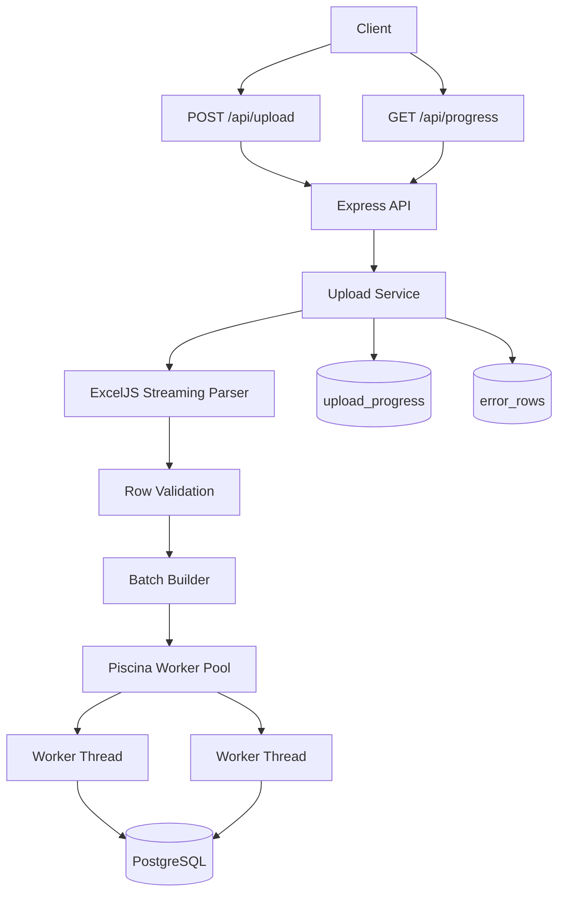

# 🚀 Bulk Excel Processor


High-performance backend system for processing large Excel files and importing millions of records into PostgreSQL using asynchronous processing, worker threads, streaming parsers, and batched database operations.

Designed to handle large-scale data imports efficiently without blocking API requests while providing real-time progress tracking, fault tolerance, and optimized database performance.

---

# 🎯 Problem Statement

Traditional Excel import systems often suffer from:

- High memory consumption
- Slow processing speeds
- API timeouts
- Database bottlenecks
- Poor scalability
- Lack of progress visibility

Bulk Excel Processor solves these challenges through streaming file processing, parallel worker execution, batch database inserts, retry mechanisms, and real-time job monitoring.

---

# ✨ Features

## ⚡ Asynchronous Processing

- Immediate API response after upload
- Background processing workflow
- Non-blocking architecture

## 📊 Large File Support

- Streaming Excel parsing using ExcelJS
- Memory-efficient processing
- Supports large datasets

## 🧵 Parallel Processing

- Piscina worker thread pool
- Concurrent batch execution
- Improved throughput

## 🗄️ Optimized Database Operations

- Batch inserts (2000 records per batch)
- PostgreSQL connection pooling
- Transactional processing

## 🔄 Fault Tolerance

- Automatic retry mechanism
- Exponential backoff strategy
- Failed row tracking

## 📈 Real-Time Progress Tracking

- Upload status monitoring
- Processed record counts
- Failure statistics
- Completion tracking

## 📝 Audit Logging

- Structured JSON logging
- Error tracking
- Processing diagnostics

## ❤️ Health Monitoring

- Health check endpoints
- Graceful shutdown support
- Database connectivity validation

---

# 🛠️ Tech Stack

| Layer | Technologies |
|---------|-------------|
| Runtime | Node.js 18+ |
| Language | TypeScript |
| Framework | Express.js |
| File Processing | ExcelJS |
| Database | PostgreSQL |
| Worker Threads | Piscina |
| Upload Handling | Multer |
| Configuration | dotenv |
| Logging | Custom JSON Logger |
| Development | ts-node, nodemon |

---

# 🏗️ Architecture



---

# 🔄 Processing Workflow

1. User uploads Excel file through API.
2. File is stored temporarily.
3. API responds immediately.
4. Background job begins processing.
5. Excel rows are streamed one at a time.
6. Rows are validated.
7. Valid rows are grouped into batches of 2000.
8. Batches are distributed to worker threads.
9. Workers insert records into PostgreSQL.
10. Failed rows are logged separately.
11. Progress is continuously updated.
12. Upload status changes to completed when finished.

---

# 📈 Performance Characteristics

| Metric | Value |
|----------|---------|
| Processing Mode | Streaming |
| Batch Size | 2000 Records |
| Worker Threads | 2–4 |
| Database | PostgreSQL |
| Retry Attempts | 3 |
| Upload Size | Up to 50 MB |
| Progress Tracking | Real-Time |

---

# 📦 Database Schema

## users

```sql
CREATE TABLE users (
  id SERIAL PRIMARY KEY,
  name VARCHAR(255) NOT NULL,
  email VARCHAR(255) NOT NULL,
  age INTEGER NOT NULL,
  created_at TIMESTAMP DEFAULT CURRENT_TIMESTAMP
);
```

## upload_progress

```sql
CREATE TABLE upload_progress (
  id SERIAL PRIMARY KEY,
  total_rows INTEGER DEFAULT 0,
  processed_rows INTEGER DEFAULT 0,
  failed_rows INTEGER DEFAULT 0,
  batch_no INTEGER DEFAULT 0,
  status VARCHAR(50) DEFAULT 'processing',
  created_at TIMESTAMP DEFAULT CURRENT_TIMESTAMP,
  updated_at TIMESTAMP DEFAULT CURRENT_TIMESTAMP
);
```

## error_rows

```sql
CREATE TABLE error_rows (
  id SERIAL PRIMARY KEY,
  data JSONB NOT NULL,
  reason TEXT NOT NULL,
  created_at TIMESTAMP DEFAULT CURRENT_TIMESTAMP
);
```

---

# 🔌 API Endpoints

| Method | Endpoint | Description |
|----------|------------|--------------|
| GET | `/health` | Health Check |
| POST | `/api/upload` | Upload Excel File |
| GET | `/api/progress` | Latest Upload Status |
| GET | `/api/progress/:id` | Specific Upload Status |

---

# 📦 Installation

## Clone Repository

```bash
git clone https://github.com/tanvi-2103-git/bulk-excel-processor.git
```

## Install Dependencies

```bash
npm install
```

## Configure Environment Variables

Create a `.env` file:

```env
NODE_ENV=development

PORT=3000

DB_HOST=localhost

DB_PORT=5432

DB_DATABASE=bulk_excel_db

DB_USER=postgres

DB_PASSWORD=password

DB_POOL_MAX=20

LOG_LEVEL=INFO
```

---

# ▶️ Running the Application

## Development

```bash
npm run dev
```

## Production

```bash
npm run build

npm start
```

---

# 📤 Upload Example

```bash
curl -X POST http://localhost:3000/api/upload \
-F "file=@./sample-users.xlsx"
```

---

# 📊 Check Processing Status

```bash
curl http://localhost:3000/api/progress
```

---

# 📄 Sample Excel Format

| name | email | age |
|--------|--------|--------|
| John Doe | john@example.com | 25 |
| Jane Doe | jane@example.com | 30 |

---

# 🎯 Use Cases

- HR Employee Imports
- CRM Data Migration
- Customer Record Uploads
- Legacy System Migration
- Enterprise Data Processing
- Bulk Administrative Uploads

---

# 🔧 Technical Highlights

- Streaming Excel Processing
- Background Job Execution
- Worker Thread Concurrency
- Transactional Batch Inserts
- Retry & Recovery Mechanism
- Real-Time Monitoring
- Memory Efficient Architecture
- Structured Logging
- Production-Ready Backend Design

---

# 👨‍💻 Author

**Tanvi Dudam**

🌐 Portfolio: https://tanvi-dudam-portfolio.vercel.app

💼 LinkedIn: https://www.linkedin.com/in/tanvi-dudam/

📧 Email: tanvidudam2003@gmail.com
